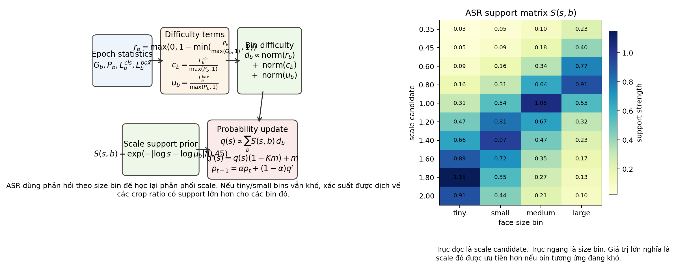
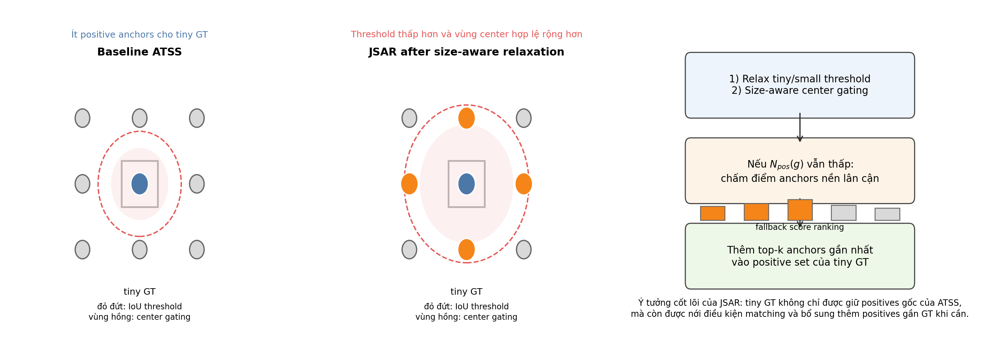
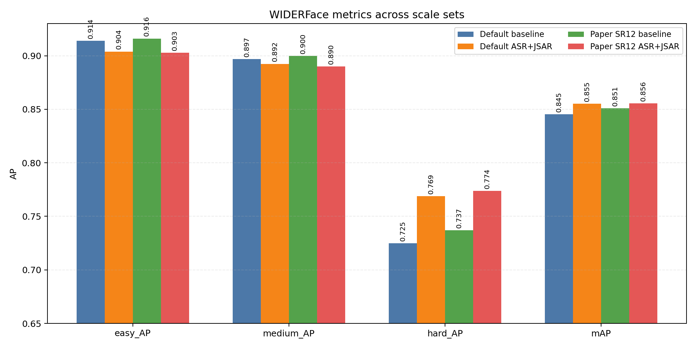
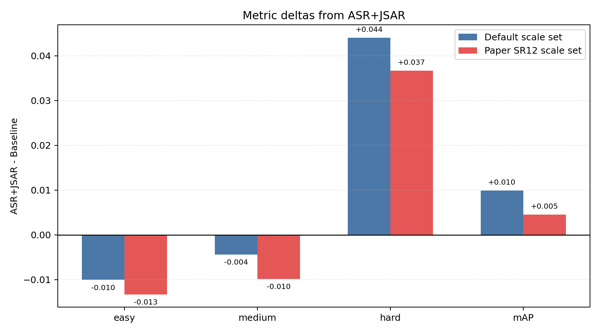
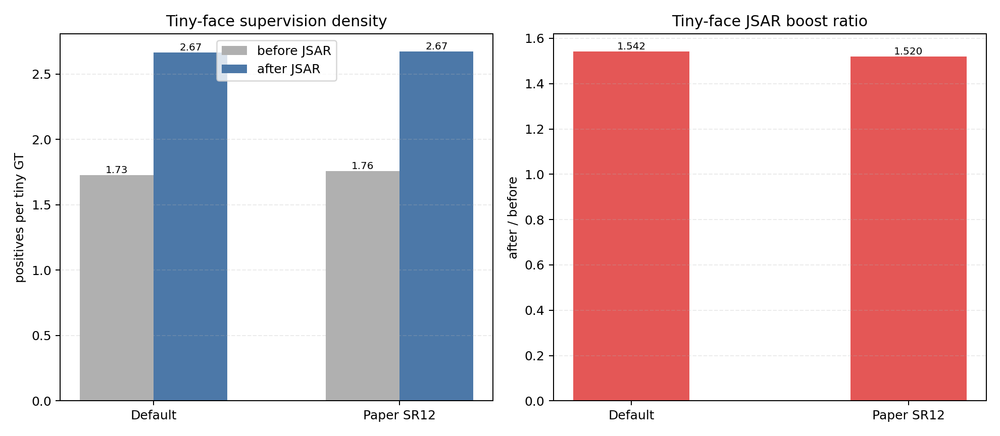
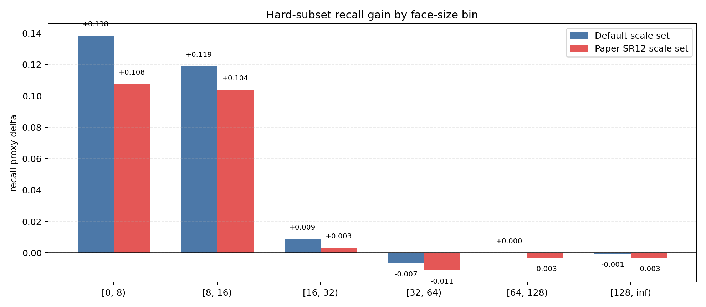
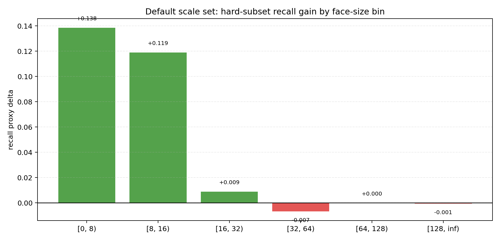
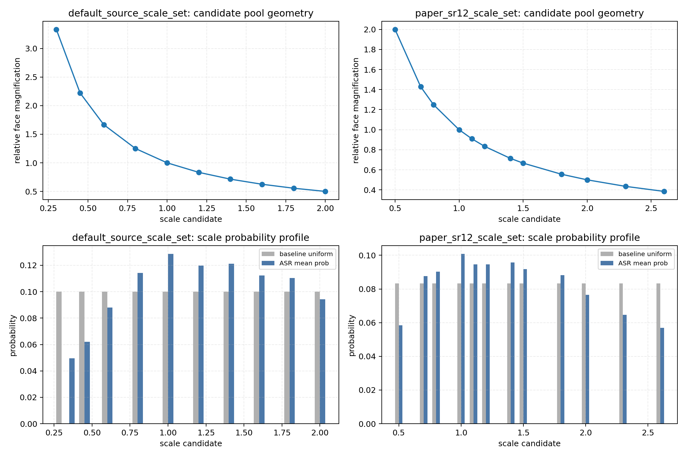
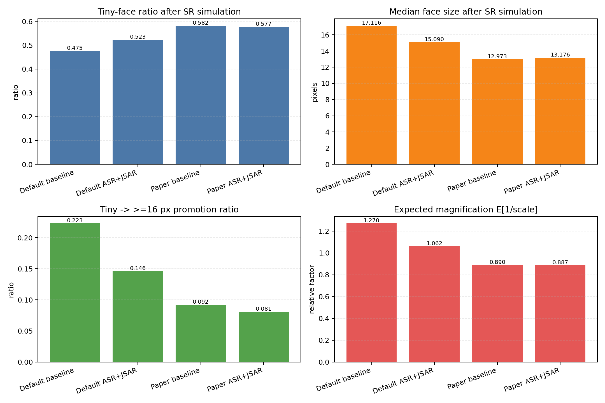

# Phân Tích Kết Quả SCRFD 2.5G Cosine: Default Scale Set vs Paper SR12

## 1. Phạm vi và lưu ý về kết quả

Báo cáo này tổng hợp hai cặp thí nghiệm:

1. `default_source_scale_set`
2. `paper_sr12_scale_set`

Cả hai đều dùng:

- `SCRFD 2.5G`
- `80 epochs`
- `cosine lr scheduler`

Riêng `paper_sr12_scale_set` trong báo cáo này là **run đã train lại với `lr=0.04`**, tức là đã khớp với setting của `default_source_scale_set`. Kết quả cũ từ bundle trước, nơi `paper_sr12_scale_set` bị train với `lr=0.02`, không còn được dùng để rút kết luận.

Hai câu hỏi chính của báo cáo:

1. Vì sao `ASR+JSAR` đều tốt hơn `baseline` ở cả hai scale set.
2. Sau khi khớp lại learning rate, nên hiểu thế nào về khác biệt giữa scale set mặc định trong source code và scale set `SR12` lấy từ phần search của paper.

## 2. Tóm tắt phương pháp cải tiến

### 2.1. Adaptive Sample Redistribution (ASR)

`ASR` thay việc chọn scale augmentation tĩnh bằng một phân phối động được cập nhật theo thống kê train. Cuối mỗi epoch, hook dùng thông tin về GT histogram, số positive anchors và loss theo size bin để điều chỉnh xác suất chọn crop ratio cho epoch sau.

Trong pipeline SCRFD này:

- `scale nhỏ` = crop nhỏ hơn = `zoom-in` = mặt lớn hơn sau resize
- `scale lớn` = crop lớn hơn = `zoom-out` = mặt nhỏ hơn sau resize

Do đó, nếu xác suất dịch về phía scale lớn hơn thì phân phối mặt sau SR sẽ nghiêng về tiny faces nhiều hơn.

### 2.2. Joint SampleAssignment Redistribution (JSAR)

`JSAR` không đổi kiến trúc hay inference. Nó chỉ can thiệp vào assignment khi train để tiny faces nhận được nhiều positive anchors hơn khi assigner gốc quá chặt.

Hiệu ứng mong muốn:

- tăng positives / GT cho tiny faces,
- gần như giữ nguyên medium / large faces,
- tăng supervision density đúng ở vùng khó nhất của WIDERFace Hard.

## 3. Tổng quan kết quả

### 3.1. Metric tổng hợp

| Scale set | Model | easy_AP | medium_AP | hard_AP | mAP |
| --- | --- | ---: | ---: | ---: | ---: |
| Default source | Baseline | 0.9140 | 0.8969 | 0.7249 | 0.8453 |
| Default source | ASR+JSAR | 0.9039 | 0.8925 | 0.7690 | 0.8551 |
| Paper SR12 | Baseline | 0.9161 | 0.8999 | 0.7371 | 0.8510 |
| Paper SR12 | ASR+JSAR | 0.9028 | 0.8901 | 0.7738 | 0.8556 |

### 3.2. Delta của ASR+JSAR so với baseline

Delta của `ASR+JSAR`:

- Default source scale set:
  - `easy_AP`: `-0.0100`
  - `medium_AP`: `-0.0044`
  - `hard_AP`: `+0.0440`
  - `mAP`: `+0.0099`
- Paper SR12 scale set:
  - `easy_AP`: `-0.0133`
  - `medium_AP`: `-0.0098`
  - `hard_AP`: `+0.0367`
  - `mAP`: `+0.0045`

Mẫu hình chung vẫn giữ nguyên:

- `ASR+JSAR` chủ yếu giúp `hard_AP`,
- đổi lại `easy_AP` và `medium_AP` giảm nhẹ,
- lợi ích mạnh nhất tập trung vào tiny/hard faces.

## 4. Vì sao ASR+JSAR tốt hơn baseline ở cả hai scale set

### 4.1. JSAR tăng mật độ supervision cho tiny faces một cách ổn định

Ở cả hai scale set, `JSAR` đều tăng rõ số positive anchors trên mỗi tiny GT:

- Default source:
  - `1.73 -> 2.67`
  - boost ratio `1.542x`
- Paper SR12:
  - `1.76 -> 2.67`
  - boost ratio `1.520x`

Điều này cho thấy `JSAR` hoạt động khá ổn định giữa các scale pool khác nhau. Khác biệt về hiệu năng giữa hai scale set không đến từ việc `JSAR` “hỏng” ở một trong hai run.

### 4.2. Gain trên hard vẫn tập trung đúng vào tiny faces

Hình trên cho thấy ở cả hai scale set, gain recall trên hard subset đều tập trung ở hai bin nhỏ nhất:

- `[0, 8)`
- `[8, 16)`

và gần như không có lợi ích ở các bin lớn hơn.

#### Default source scale set

Ở `default_source_scale_set`, delta recall proxy theo hard-size bin là:

- `[0, 8)`: `+0.138`
- `[8, 16)`: `+0.119`
- `[16, 32)`: `+0.009`
- từ `32` px trở lên: gần `0` hoặc âm nhẹ

Điều đó cho thấy lợi ích đến gần như hoàn toàn từ tiny hard faces.

#### Paper SR12 scale set

Với run `paper_sr12_scale_set` sau khi khớp learning rate, hard-subset analysis cũng cho cùng một mẫu hình:

- `[0, 8)`: `+0.108`
- `[8, 16)`: `+0.104`
- `[16, 32)`: `+0.003`
- từ `32` px trở lên: âm nhẹ

Ngoài ra:

- hard recall proxy tăng `0.8357 -> 0.8690`
- precision proxy tăng `0.0167 -> 0.0196`
- prediction count giảm `1,595,279 -> 1,416,440`

Tức là trên scale set của paper, `ASR+JSAR` vẫn bắt được thêm hard faces nhỏ và đồng thời giảm số prediction, nên gain không phải là cái giá phải trả bằng việc phun thêm nhiều false positives.

### 4.3. ASR và JSAR bổ sung cho nhau

Hai thành phần giải quyết hai vấn đề khác nhau:

- `ASR` thay đổi loại crop mà model thấy thường xuyên hơn.
- `JSAR` biến các sample tiny/hard đó thành supervision dày hơn.

Nếu chỉ có `ASR`, tiny faces vẫn có thể bị under-assigned. Nếu chỉ có `JSAR`, model lại chưa chắc đã thấy đủ nhiều sample tiny/hard để tận dụng lợi ích của positive expansion. Lợi ích lớn nhất đến từ việc cả hai cùng đẩy training signal về tiny faces.

## 5. So sánh chéo giữa default scale set và paper SR12 sau khi khớp learning rate

Sau khi train lại `paper_sr12_scale_set` với `lr=0.04`, kết luận đã thay đổi so với bundle cũ:

- `paper_sr12` **không còn kém hơn rõ rệt**.
- `paper_sr12 baseline` thực ra mạnh hơn `default baseline`.
- `paper_sr12 ASR+JSAR` gần như ngang với `default ASR+JSAR`, và nhỉnh hơn nhẹ ở `hard_AP` và `mAP`.

### 5.1. Scale pool của paper SR12 vẫn tiny-oriented hơn rất nhiều

Một số thống kê quan trọng:

- Default baseline:
  - `E[1/scale] = 1.270`
  - extreme zoom-in mass (`scale <= 0.6`) = `0.300`
  - extreme zoom-out mass (`scale >= 2.0`) = `0.100`
- Paper SR12 baseline:
  - `E[1/scale] = 0.890`
  - extreme zoom-in mass (`scale <= 0.6`) = `0.083`
  - extreme zoom-out mass (`scale >= 2.0`) = `0.250`

Điều này nghĩa là scale pool `SR12` về bản chất đã:

- ít zoom-in mạnh hơn,
- nhiều zoom-out mạnh hơn,
- và do đó tạo ra train distribution thiên về tiny faces ngay từ baseline.

### 5.2. Static paper SR12 baseline đã “ăn trước” một phần lợi ích mà ASR phải tạo ra ở default scale set

Sau SR simulation:

- Default baseline:
  - tiny ratio = `0.475`
  - median face size = `17.12`
  - tiny -> `>=16px` promotion ratio = `0.223`
- Paper SR12 baseline:
  - tiny ratio = `0.582`
  - median face size = `12.97`
  - tiny -> `>=16px` promotion ratio = `0.092`

Nói ngắn gọn:

- baseline của `paper_sr12` đã đẩy train distribution mạnh vào vùng tiny/hard,
- nên bản thân baseline đã mạnh hơn trên hard faces,
- và khoảng trống để `ASR+JSAR` tiếp tục cải thiện sẽ nhỏ hơn.

Đó là lý do delta của `ASR+JSAR` trên `paper_sr12` nhỏ hơn:

- `hard_AP`: `+0.0367` thay vì `+0.0440`
- `mAP`: `+0.0045` thay vì `+0.0099`

Không phải vì phương pháp yếu đi, mà vì baseline của scale set này đã mang sẵn một thiên hướng tiny-focused mạnh hơn.

### 5.3. ASR trên paper SR12 chủ yếu làm mềm bớt các extreme scales, không còn phải “dịch pha” phân phối mạnh như ở default

Từ `report_summary.json`:

- Default:
  - baseline `E[1/scale] = 1.270`
  - improved `E[1/scale] = 1.062`
- Paper SR12:
  - baseline `E[1/scale] = 0.890`
  - improved `E[1/scale] = 0.887`

Ở default scale set, `ASR` phải thay đổi phân phối đáng kể để kéo training signal về tiny faces. Ở paper SR12, baseline vốn đã tiny-heavy, nên `ASR` chỉ còn điều chỉnh tương đối nhẹ quanh không gian sẵn có.

Điều này cũng khớp với face-size simulation:

- Paper baseline tiny ratio `0.582`
- Paper improved tiny ratio `0.577`

Tức là trên scale set của paper, `ASR` không còn “đẩy sang tiny” mạnh nữa; nó thiên về cân bằng lại một scale pool vốn đã rất tiny-biased.

### 5.4. Khác biệt giữa hai scale set hiện nay nên được hiểu như thế nào

Với learning rate đã khớp:

- Default source scale set:
  - baseline yếu hơn một chút trên Hard
  - nên `ASR+JSAR` có nhiều headroom hơn để cải thiện
- Paper SR12 scale set:
  - baseline đã mạnh hơn vì static SR đã thiên về tiny faces
  - nên `ASR+JSAR` vẫn giúp, nhưng gain biên nhỏ hơn

Tóm lại, sự khác biệt chính bây giờ không còn là “scale set nào đúng, scale set nào sai”, mà là:

- scale set mặc định cần `ASR+JSAR` nhiều hơn để bù lại static SR chưa đủ tiny-oriented,
- còn `paper SR12` đã mang sẵn bias tiny-focused, nên baseline mạnh hơn và biên cải thiện nhỏ hơn.

## 6. Kết luận

### 6.1. Về ASR+JSAR

`ASR+JSAR` tốt hơn baseline ở cả hai scale set vì:

- `ASR` điều chỉnh distribution của crop ratios trong train,
- `JSAR` tăng mật độ positive supervision đúng vào tiny faces,
- gain trên Hard luôn tập trung ở `[0, 8)` và `[8, 16)`.

Đây là bằng chứng khá trực tiếp rằng cải tiến đang làm đúng điều nó được thiết kế để làm.

### 6.2. Về default source scale set và paper SR12

Sau khi train lại `paper_sr12_scale_set` với `lr=0.04`:

- `paper SR12 baseline` mạnh hơn `default baseline`,
- `paper SR12 ASR+JSAR` gần như ngang và hơi nhỉnh hơn `default ASR+JSAR`,
- chênh lệch trước đó hóa ra chủ yếu đến từ việc so sánh hai run với learning rate không khớp.

Vì vậy, kết luận cập nhật là:

- scale set `SR12` của paper **không tệ hơn** trong setting này khi learning rate được khớp đúng,
- nhưng vì baseline của nó đã rất tiny-oriented, nên `ASR+JSAR` chỉ mang lại gain biên nhỏ hơn so với default scale set,
- còn cơ chế gain cốt lõi của `ASR+JSAR` thì vẫn nhất quán: tăng supervision và recall đúng ở tiny hard faces.
