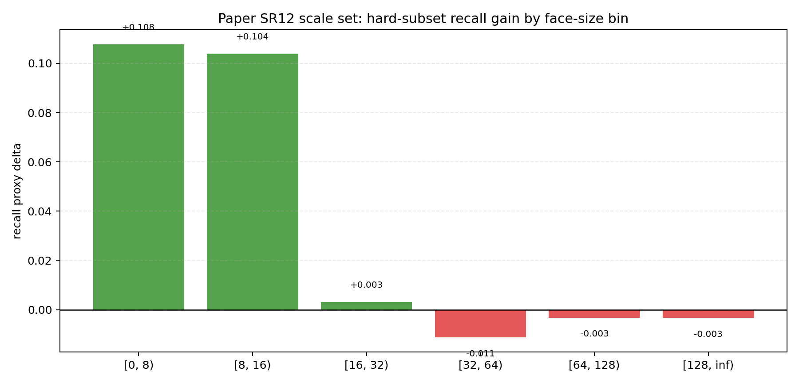

# Phân Tích Kết Quả SCRFD 2.5G Cosine: Default Scale Set vs Paper SR12

## 1. Mục tiêu

Báo cáo này phân tích hai câu hỏi:

1. Vì sao `ASR+JSAR` đều tốt hơn `baseline` ở cả hai scale set.
2. Nên hiểu thế nào về khác biệt giữa scale set mặc định trong source code và scale set `SR12` lấy từ phần search của paper.

Hai cặp thí nghiệm được so sánh:

- `default_source_scale_set`
- `paper_sr12_scale_set`

Trong cả hai cặp, cùng một kiến trúc `SCRFD 2.5G` được train `80 epochs` với `cosine scheduler`; khác biệt chính nằm ở static scale pool mà pipeline `RandomSquareCrop` được phép lấy mẫu.

## 2. Phương pháp cải tiến

### 2.1. Adaptive Sample Redistribution (ASR)

`ASR` thay việc chọn scale augmentation tĩnh bằng một phân phối động, được cập nhật từ thống kê của chính quá trình train.

Hình trên chỉ minh hoạ ý tưởng của ASR:

- bên trái: static scale pool ban đầu và ý nghĩa hình học của từng `scale`
- ở giữa: vòng phản hồi từ thống kê train sang difficulty của từng size bin, rồi quay lại cập nhật scale policy
- bên phải: phân phối face size sau `crop + resize` dịch về phía nhiều tiny / small cases hơn

Trong implementation hiện tại, hook thu thống kê theo size bin `b`:

- `G_b`: số ground-truth faces
- `P_b`: số matched positive anchors
- `L^cls_b`: tổng classification loss
- `L^box_b`: tổng box loss

Từ đó tính ba thành phần độ khó:

$$
r_b = \max\!\left(0,\; 1 - \min\!\left(\frac{P_b}{\max(G_b,1)},\; 1\right)\right)
$$

$$
c_b = \frac{L^{cls}_b}{\max(P_b,1)}, \qquad
u_b = \frac{L^{box}_b}{\max(P_b,1)}
$$

Với `ADAPTIVE_SR_DIFFICULTY_MODE='loss_recall'`, độ khó của từng bin được cộng từ ba thành phần đã chuẩn hóa:

$$
\operatorname{norm}(x)_b = \frac{x_b}{\operatorname{mean}(x_{x>0}) + \varepsilon}
$$

$$
d_b \propto \operatorname{norm}(r_b) + \operatorname{norm}(c_b) + \operatorname{norm}(u_b)
$$

Sau đó difficulty theo bin được chiếu sang scale candidates thông qua ma trận support:

$$
S(s,b) = \exp\!\left(-\frac{|\log s - \log \mu_b|}{0.45}\right)
$$

với `mu_b` là tâm ưu tiên cho từng bin. Xác suất thô của mỗi scale là:

$$
q(s) \propto \sum_b S(s,b)\, d_b
$$

Sau bước probability floor và EMA smoothing:

$$
q'(s) = q(s)(1-Km) + m
$$

$$
p_{t+1}(s) = \alpha\, p_t(s) + (1-\alpha)\, q'(s)
$$

trong đó:

- `K` là số scale candidates
- `m` là `ADAPTIVE_SR_MIN_PROB`
- `α` là `ADAPTIVE_SR_EMA`

Điểm quan trọng của pipeline này là:

- `scale nhỏ` = crop nhỏ hơn = `zoom-in` = mặt lớn hơn sau resize
- `scale lớn` = crop lớn hơn = `zoom-out` = mặt nhỏ hơn sau resize

Nên khi `ASR` tăng xác suất ở các scale lớn, distribution sau SR sẽ dịch về phía nhiều tiny faces hơn.

### 2.2. Joint SampleAssignment Redistribution (JSAR)

`JSAR` không đổi backbone, neck, head hay inference. Nó chỉ thay đổi target assignment khi train để tiny/small faces không bị under-supervise.

Hình trên minh hoạ ba ý chính của JSAR:

- trái: với tiny GT, ATSS gốc thường chỉ giữ rất ít positives
- giữa: `JSAR` nới threshold và center gating để nhiều anchors gần tiny GT còn hợp lệ
- phải: nếu vẫn thiếu positives thì kích hoạt fallback, lấy thêm `top-k` anchors nền gần GT nhất theo một matching score

`JSAR` được cài trên `ATSSAssigner` theo ba bước.

#### Bước 1: nới threshold theo kích thước GT

ATSS gốc dùng:

$$
\tau_g = \mu_g + \sigma_g
$$

`JSAR` thay bằng:

$$
\tau'_g = \tau_g - \Delta_g
$$

trong đó:

$$
\Delta_g =
\begin{cases}
\delta_{tiny}, & \text{nếu } \operatorname{size}_g < T_{tiny} \\
\delta_{small}, & \text{nếu } T_{tiny} \le \operatorname{size}_g < T_{small} \\
0, & \text{nếu } \operatorname{size}_g \ge T_{small}
\end{cases}
$$

Điều này làm tiny/small GT dễ nhận positives hơn ngay từ bước thresholding.

#### Bước 2: center gating theo kích thước

Center gating cũng được làm size-aware bằng hệ số:

$$
c_g = \operatorname{clip}\!\left(\frac{\operatorname{size}_g}{T_{tiny}}, 1, \rho\right)
$$

$$
\operatorname{valid}(a,g):\ d_{min}(a,g)\, c_g > t_{center}
$$

`rho` ở đây là `JSAR_CENTER_RADIUS_SCALE`. Mục đích là bớt loại bỏ quá sớm các anchors gần tiny GT.

#### Bước 3: hybrid fallback cho GT còn thiếu positives

Nếu sau hai bước trên, tiny/small GT vẫn có quá ít positives:

$$
N_{pos}(g) < N_{min}
$$

thì `JSAR` lấy thêm một vài anchors nền lân cận, theo score:

$$
\operatorname{score}(a,g) =
\operatorname{IoU}(a,g) -
0.05 \cdot \frac{\operatorname{dist}(a,g)}{\max(\operatorname{size}_g,1)}
$$

và thêm `top-k` anchors tốt nhất vào tập positive. Trong chế độ `soft_weight`, các positives này còn có trọng số mềm:

$$
w(a,g) =
\exp\!\left(-\frac{\operatorname{dist}_{norm}}{T}\right)
\cdot
\operatorname{clamp}\!\left(\operatorname{IoU}(a,g)+0.1,\ 0.05,\ 1.0\right)
$$

Nhưng trong các run hiện tại, chế độ chính là `hybrid_fallback`, tức là:

- nới threshold
- nới center gating
- nếu vẫn thiếu positives thì thêm `top-k` anchors nền gần GT nhất theo score

## 3. Tổng quan kết quả

### 3.1. Metric tổng hợp

| Scale set | Model | easy_AP | medium_AP | hard_AP | mAP |
| --- | --- | ---: | ---: | ---: | ---: |
| Default source | Baseline | 0.9140 | 0.8969 | 0.7249 | 0.8453 |
| Default source | ASR+JSAR | 0.9039 | 0.8925 | 0.7690 | 0.8551 |
| Paper SR12 | Baseline | 0.9161 | 0.8999 | 0.7371 | 0.8510 |
| Paper SR12 | ASR+JSAR | 0.9028 | 0.8901 | 0.7738 | 0.8556 |

### 3.2. Delta của ASR+JSAR so với baseline

Delta của `ASR+JSAR`:

- Default source scale set:
  - `easy_AP`: `-0.0100`
  - `medium_AP`: `-0.0044`
  - `hard_AP`: `+0.0440`
  - `mAP`: `+0.0099`
- Paper SR12 scale set:
  - `easy_AP`: `-0.0133`
  - `medium_AP`: `-0.0098`
  - `hard_AP`: `+0.0367`
  - `mAP`: `+0.0045`

Mẫu hình chung rất rõ:

- lợi ích lớn nhất nằm ở `hard_AP`
- `easy_AP` và `medium_AP` giảm nhẹ
- `mAP` tăng nhờ gain trên hard faces bù cho phần giảm ở easy/medium

Điều này cho thấy `ASR+JSAR` là cải tiến chuyên biệt cho tiny/hard faces, chứ không phải cải tiến đồng đều cho mọi độ khó.

## 4. Vì sao ASR+JSAR tốt hơn baseline ở cả hai scale set

### 4.1. JSAR tăng mật độ supervision cho tiny faces một cách ổn định

Ở cả hai scale set:

- Default source:
  - tiny positives / GT: `1.73 -> 2.67`
  - boost ratio: `1.542x`
- Paper SR12:
  - tiny positives / GT: `1.76 -> 2.67`
  - boost ratio: `1.520x`

Điều này nói lên một điều quan trọng: `JSAR` hoạt động gần như nhất quán giữa hai scale pool. Phần gain của phương pháp không đến từ ngẫu nhiên, mà đến từ việc tiny faces thực sự nhận được supervision dày hơn.

### 4.2. Gain trên hard subset tập trung đúng vào tiny faces

Ở cả hai scale set, gain recall trên hard subset đều tập trung vào:

- `[0, 8)`
- `[8, 16)`

và gần như không có lợi ích ở các bin lớn hơn.

#### Default source scale set

Delta recall proxy theo hard-size bin:

- `[0, 8)`: `+0.138`
- `[8, 16)`: `+0.119`
- `[16, 32)`: `+0.009`
- từ `32` px trở lên: gần `0` hoặc âm nhẹ

#### Paper SR12 scale set

Delta recall proxy theo hard-size bin:

- `[0, 8)`: `+0.108`
- `[8, 16)`: `+0.104`
- `[16, 32)`: `+0.003`
- từ `32` px trở lên: âm nhẹ

Ngoài ra, ở `paper_sr12_scale_set`:

- hard recall proxy tăng `0.8357 -> 0.8690`
- precision proxy tăng `0.0167 -> 0.0196`
- prediction count giảm `1,595,279 -> 1,416,440`

Tức là `ASR+JSAR` không chỉ bắt thêm tiny hard faces, mà còn làm output gọn hơn ở ngưỡng đang test.

### 4.3. Vai trò bổ sung giữa ASR và JSAR

Hai thành phần giải quyết hai nút thắt khác nhau:

- `ASR` đổi phân phối sample mà model thường xuyên nhìn thấy.
- `JSAR` đổi mật độ target supervision mà tiny faces nhận được.

Nếu chỉ có `ASR`, tiny faces vẫn có thể bị under-assigned. Nếu chỉ có `JSAR`, model lại chưa chắc đã thấy đủ nhiều tình huống tiny/hard để tận dụng lợi ích của positive expansion. Việc cả hai cùng hướng training signal về tiny faces mới tạo ra gain rõ ràng trên Hard.

## 5. Cách hiểu khác biệt giữa default scale set và paper SR12

### 5.1. Paper SR12 có static scale pool tiny-oriented hơn

Một số thống kê chính:

- Default baseline:
  - `E[1/scale] = 1.270`
  - extreme zoom-in mass (`scale <= 0.6`) = `0.300`
  - extreme zoom-out mass (`scale >= 2.0`) = `0.100`
- Paper SR12 baseline:
  - `E[1/scale] = 0.890`
  - extreme zoom-in mass (`scale <= 0.6`) = `0.083`
  - extreme zoom-out mass (`scale >= 2.0`) = `0.250`

Điều này cho thấy static scale pool `SR12` vốn đã:

- ít zoom-in mạnh hơn,
- nhiều zoom-out mạnh hơn,
- và vì thế tự nhiên đẩy train distribution về phía tiny faces nhiều hơn.

### 5.2. Phân phối mặt sau SR của paper SR12 đã rất “tiny-heavy” ngay từ baseline

So với default scale set:

- Default baseline:
  - tiny ratio = `0.475`
  - median face size = `17.12`
  - tiny -> `>=16px` promotion ratio = `0.223`
- Paper SR12 baseline:
  - tiny ratio = `0.582`
  - median face size = `12.97`
  - tiny -> `>=16px` promotion ratio = `0.092`

Nói cách khác:

- baseline của `paper_sr12` đã nhìn thấy nhiều tiny faces hơn đáng kể,
- nhưng đồng thời cũng ít “promote” tiny faces sang vùng dễ học hơn.

Điều này giải thích vì sao:

- `paper SR12 baseline` vốn đã mạnh hơn `default baseline` trên Hard
- nhưng gain biên của `ASR+JSAR` lại nhỏ hơn một chút so với default scale set

Bởi vì một phần lợi ích mà `ASR` cần tạo ra ở default scale set đã được scale pool `SR12` mang sẵn vào baseline.

### 5.3. ASR trên paper SR12 thiên về điều chỉnh mềm hơn là dịch phân phối mạnh

Từ `report_summary.json`:

- Default:
  - baseline `E[1/scale] = 1.270`
  - improved `E[1/scale] = 1.062`
- Paper SR12:
  - baseline `E[1/scale] = 0.890`
  - improved `E[1/scale] = 0.887`

Ở default scale set, `ASR` phải dịch phân phối khá mạnh để kéo training signal về tiny faces. Ở paper SR12, baseline vốn đã rất tiny-oriented, nên `ASR` chủ yếu làm mềm bớt các extreme scales hơn là tạo ra một dịch chuyển lớn.

Điều này cũng khớp với face-size simulation:

- Paper baseline tiny ratio: `0.582`
- Paper improved tiny ratio: `0.577`

Tức là `ASR` trên paper SR12 không còn đẩy thêm mạnh sang tiny regime nữa; nó chỉ tinh chỉnh một scale pool vốn đã rất tiny-biased.

### 5.4. Kết luận thực nghiệm giữa hai scale set

Trong các kết quả hiện tại:

- `paper SR12 baseline` mạnh hơn `default baseline`
- `paper SR12 ASR+JSAR` gần như ngang và hơi nhỉnh hơn `default ASR+JSAR`
- nhưng delta của `ASR+JSAR` so với baseline lại nhỏ hơn

Cách hiểu hợp lý nhất là:

- `default_source_scale_set` cần `ASR+JSAR` nhiều hơn để bù cho static SR chưa đủ tiny-focused
- `paper_sr12_scale_set` đã mang sẵn thiên hướng tiny-focused trong baseline
- vì vậy headroom để `ASR+JSAR` cải thiện thêm sẽ nhỏ hơn, dù cơ chế gain của phương pháp vẫn giữ nguyên

## 6. Kết luận

### 6.1. Về ASR+JSAR

`ASR+JSAR` tốt hơn baseline ở cả hai scale set vì:

- `ASR` học lại phân phối scale từ tín hiệu difficulty theo size bin
- `JSAR` tăng mật độ positive assignment đúng vào tiny/small faces
- gain trên Hard luôn tập trung chủ yếu ở `[0, 8)` và `[8, 16)`

Đây là bằng chứng trực tiếp rằng cải tiến đang làm đúng điều nó được thiết kế để làm: tăng training signal ở nhóm mặt nhỏ và khó nhất.

### 6.2. Về default scale set và paper SR12

Các kết quả hiện tại không ủng hộ nhận định rằng `paper SR12` tệ hơn. Thay vào đó:

- `paper SR12` cho baseline mạnh hơn
- `paper SR12 + ASR+JSAR` gần như ngang và hơi nhỉnh hơn nhẹ
- khác biệt chính nằm ở việc static scale pool `SR12` đã tiny-oriented hơn ngay từ đầu

Tóm lại:

- `ASR+JSAR` là cải tiến ổn định cho tiny/hard faces
- hiệu quả biên của nó phụ thuộc vào static scale pool ban đầu
- scale pool càng tiny-oriented sẵn, baseline càng mạnh và phần gain bổ sung của `ASR+JSAR` càng nhỏ hơn
