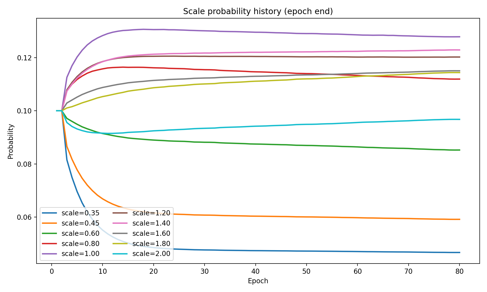
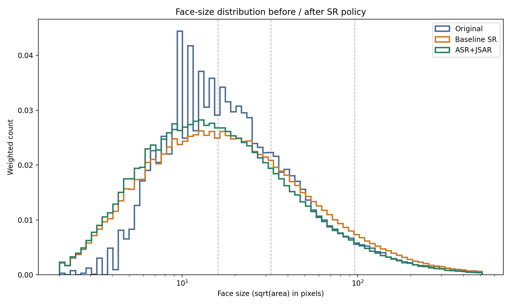
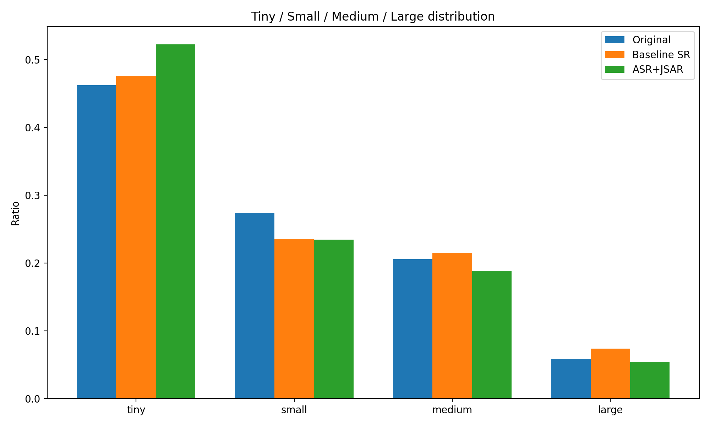
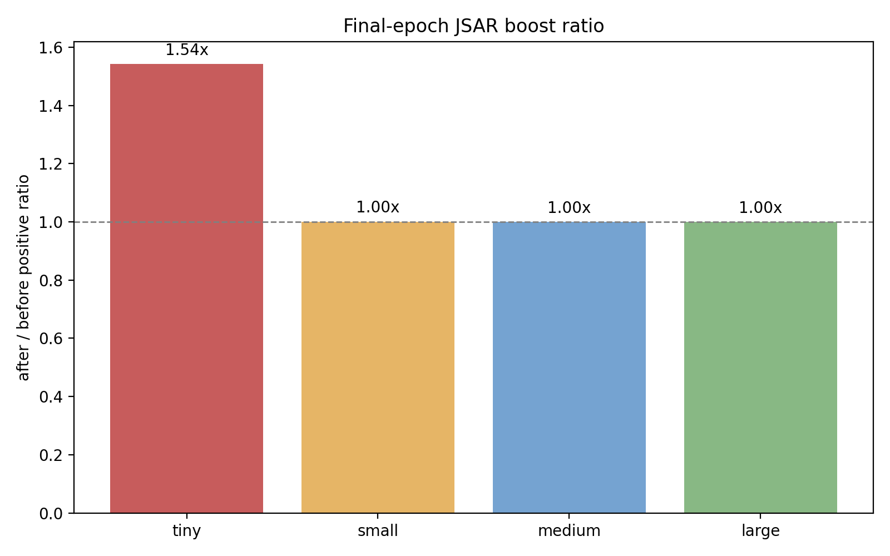
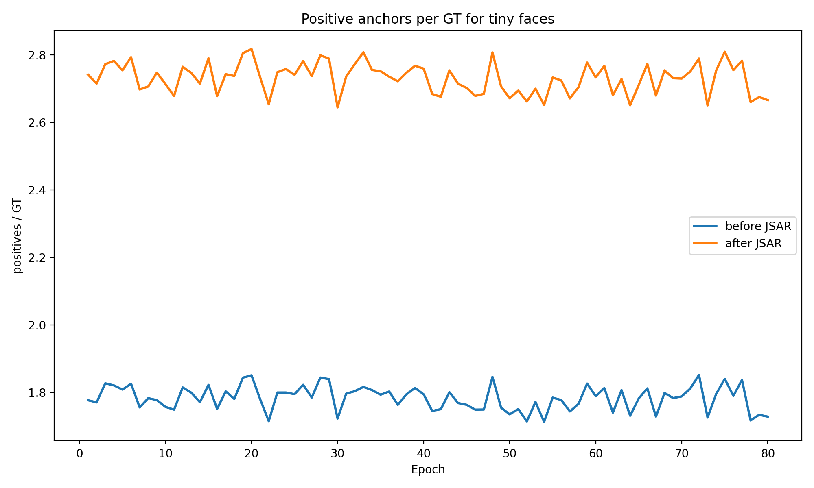
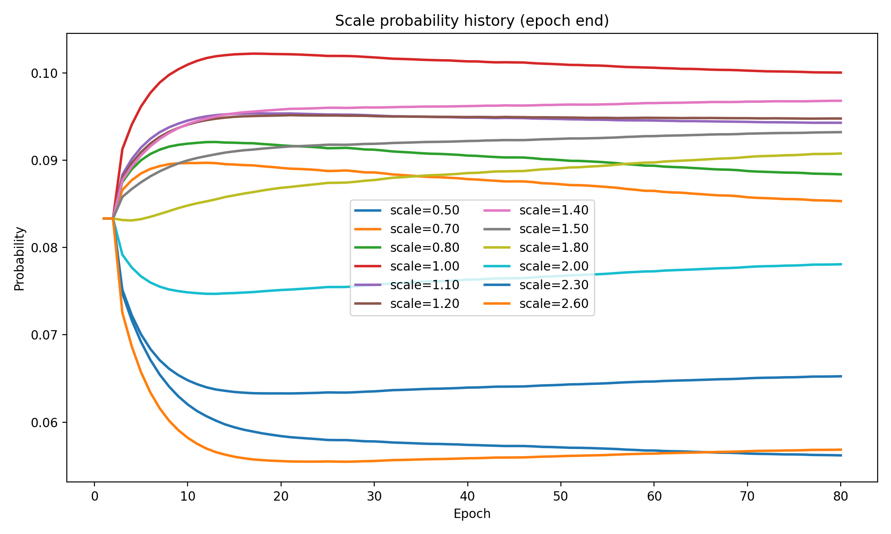
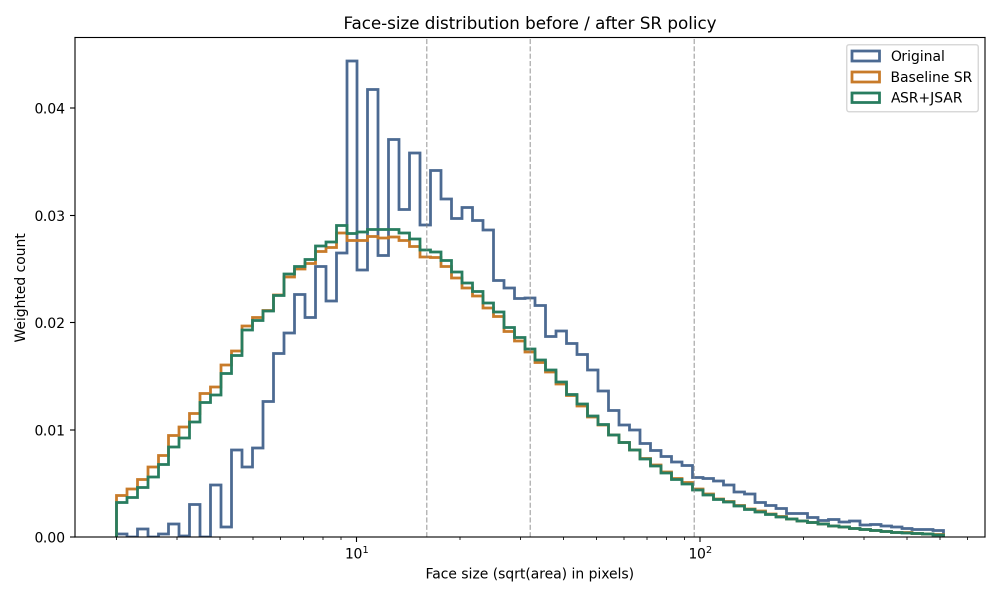
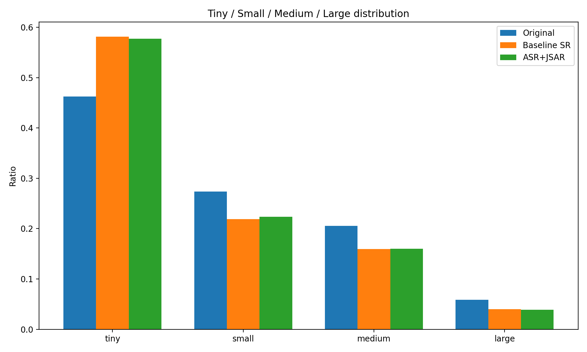
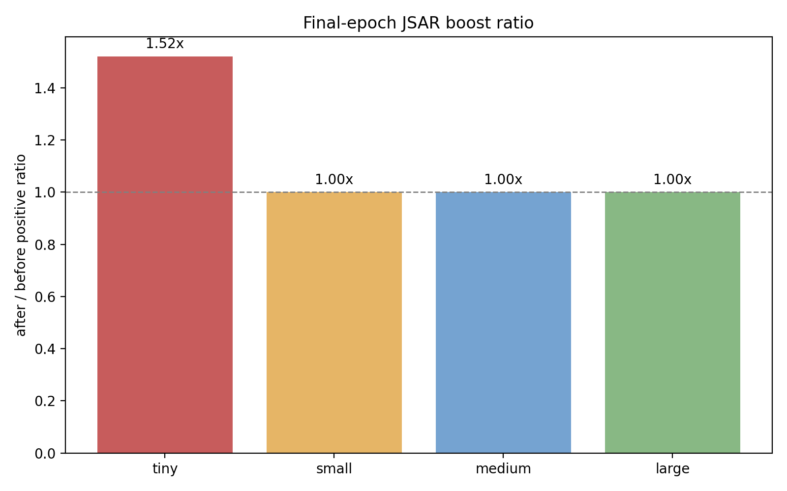
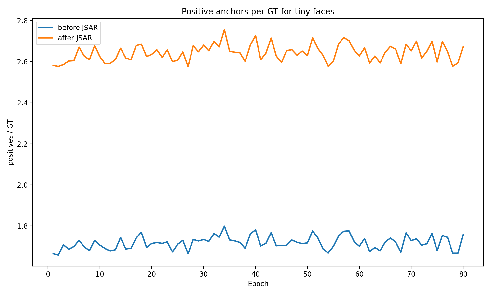

# SCRFD 2.5G Cosine Scale-Set Results

- [ANALYSIS_REPORT.md](ANALYSIS_REPORT.md): Báo cáo phân tích vì sao ASR+JSAR tốt hơn baseline ở cả hai scale set và cách hiểu đúng về khác biệt giữa default scale set và paper SR12 sau khi khớp learning rate.

## Runs

| Run | Baseline config | ASR+JSAR config |
| --- | --- | --- |
| `default_source_scale_set` | `scrfd_2.5g_80e_cosine_baseline.py` | `scrfd_2.5g_80e_cosine_asr_jsar.py` |
| `paper_sr12_scale_set` | `scrfd_2.5g_80e_cosine_baseline_paper_sr12.py` | `scrfd_2.5g_80e_cosine_asr_jsar_paper_sr12.py` |

## Metric Summary

| Run | Model | easy_AP | medium_AP | hard_AP | mAP |
| --- | --- | ---: | ---: | ---: | ---: |
| `default_source_scale_set` | Baseline | 0.9140 | 0.8969 | 0.7249 | 0.8453 |
| `default_source_scale_set` | ASR+JSAR | 0.9039 | 0.8925 | 0.7690 | 0.8551 |
| `paper_sr12_scale_set` | Baseline | 0.9161 | 0.8999 | 0.7371 | 0.8510 |
| `paper_sr12_scale_set` | ASR+JSAR | 0.9028 | 0.8901 | 0.7738 | 0.8556 |

## `default_source_scale_set`

### Metrics

- [comparison/comparison.md](default_source_scale_set/comparison/comparison.md): WIDERFace comparison between baseline and ASR+JSAR.
- [metrics/baseline_results_summary.json](default_source_scale_set/metrics/baseline_results_summary.json): Baseline WIDERFace summary.
- [metrics/asr_jsar_results_summary.json](default_source_scale_set/metrics/asr_jsar_results_summary.json): ASR+JSAR WIDERFace summary.

### Scale Probability

- [scale_prob_history/scale_prob_history_epoch_end.png](default_source_scale_set/scale_prob_history/scale_prob_history_epoch_end.png): Adaptive scale probability history by epoch.
- [scale_prob_history/scale_prob_history.csv](default_source_scale_set/scale_prob_history/scale_prob_history.csv): Adaptive scale probability table.
- [scale_prob_history/scale_prob_history_summary.json](default_source_scale_set/scale_prob_history/scale_prob_history_summary.json): Adaptive scale probability metadata.

### Face Size Distribution

- [face_size_analysis/analysis.md](default_source_scale_set/face_size_analysis/analysis.md): Face-size distribution analysis summary.
- [face_size_analysis/face_size_histogram.png](default_source_scale_set/face_size_analysis/face_size_histogram.png): Histogram of original, baseline SR, and ASR+JSAR face sizes.
- [face_size_analysis/face_size_cdf.png](default_source_scale_set/face_size_analysis/face_size_cdf.png): CDF of original, baseline SR, and ASR+JSAR face sizes.
- [face_size_analysis/face_size_bin_ratios.png](default_source_scale_set/face_size_analysis/face_size_bin_ratios.png): Tiny / small / medium / large ratios after SR simulation.
- [face_size_analysis/scale_probabilities.png](default_source_scale_set/face_size_analysis/scale_probabilities.png): Mean scale probabilities used in the SR simulation.
- [face_size_analysis/baseline_transition_heatmap.png](default_source_scale_set/face_size_analysis/baseline_transition_heatmap.png): Baseline SR transition heatmap from raw size bins to augmented size bins.
- [face_size_analysis/asr_jsar_transition_heatmap.png](default_source_scale_set/face_size_analysis/asr_jsar_transition_heatmap.png): ASR+JSAR transition heatmap from raw size bins to augmented size bins.
- [face_size_analysis/face_size_distribution_summary.csv](default_source_scale_set/face_size_analysis/face_size_distribution_summary.csv): Face-size distribution summary table.
- [face_size_analysis/face_size_distribution_analysis.json](default_source_scale_set/face_size_analysis/face_size_distribution_analysis.json): Face-size distribution analysis data.
- [face_size_analysis/baseline_transition_matrix.csv](default_source_scale_set/face_size_analysis/baseline_transition_matrix.csv): Baseline SR transition matrix.
- [face_size_analysis/asr_jsar_transition_matrix.csv](default_source_scale_set/face_size_analysis/asr_jsar_transition_matrix.csv): ASR+JSAR transition matrix.

### JSAR Assignment

- [jsar_assignment/jsar_final_boost_ratio.png](default_source_scale_set/jsar_assignment/jsar_final_boost_ratio.png): Final positive-assignment boost ratio by size bin.
- [jsar_assignment/jsar_tiny_pos_per_gt.png](default_source_scale_set/jsar_assignment/jsar_tiny_pos_per_gt.png): Tiny-face positives per ground-truth over epochs.
- [jsar_assignment/jsar_boost_ratios.png](default_source_scale_set/jsar_assignment/jsar_boost_ratios.png): Positive-assignment boost ratios by size bin over training.
- [jsar_assignment/jsar_tiny_pos_counts.png](default_source_scale_set/jsar_assignment/jsar_tiny_pos_counts.png): Tiny-face positive counts over epochs.
- [jsar_assignment/jsar_small_pos_counts.png](default_source_scale_set/jsar_assignment/jsar_small_pos_counts.png): Small-face positive counts over epochs.
- [jsar_assignment/jsar_small_pos_per_gt.png](default_source_scale_set/jsar_assignment/jsar_small_pos_per_gt.png): Small-face positives per ground-truth over epochs.
- [jsar_assignment/jsar_assignment_history.csv](default_source_scale_set/jsar_assignment/jsar_assignment_history.csv): JSAR assignment history table.
- [jsar_assignment/jsar_assignment_summary.json](default_source_scale_set/jsar_assignment/jsar_assignment_summary.json): JSAR assignment history metadata.

### Hard Subset

- [hard_subset_analysis/hard_subset_analysis.md](default_source_scale_set/hard_subset_analysis/hard_subset_analysis.md): Hard-subset per-image analysis summary.
- [hard_subset_analysis/hard_subset_analysis.json](default_source_scale_set/hard_subset_analysis/hard_subset_analysis.json): Hard-subset per-image analysis data.
- [hard_subset_analysis/hard_size_bins.csv](default_source_scale_set/hard_subset_analysis/hard_size_bins.csv): Hard-subset size-bin statistics.
- [hard_subset_analysis/top_improved_images.csv](default_source_scale_set/hard_subset_analysis/top_improved_images.csv): Top hard-subset images with the largest recall gain.
- [hard_subset_analysis/top_regressed_images.csv](default_source_scale_set/hard_subset_analysis/top_regressed_images.csv): Top hard-subset images with the largest recall drop.

## `paper_sr12_scale_set`

### Metrics

- [comparison/comparison.md](paper_sr12_scale_set/comparison/comparison.md): WIDERFace comparison between baseline and ASR+JSAR.
- [metrics/baseline_results_summary.json](paper_sr12_scale_set/metrics/baseline_results_summary.json): Baseline WIDERFace summary.
- [metrics/asr_jsar_results_summary.json](paper_sr12_scale_set/metrics/asr_jsar_results_summary.json): ASR+JSAR WIDERFace summary.

### Scale Probability

- [scale_prob_history/scale_prob_history_epoch_end.png](paper_sr12_scale_set/scale_prob_history/scale_prob_history_epoch_end.png): Adaptive scale probability history by epoch.
- [scale_prob_history/scale_prob_history.csv](paper_sr12_scale_set/scale_prob_history/scale_prob_history.csv): Adaptive scale probability table.
- [scale_prob_history/scale_prob_history_summary.json](paper_sr12_scale_set/scale_prob_history/scale_prob_history_summary.json): Adaptive scale probability metadata.

### Face Size Distribution

- [face_size_analysis/analysis.md](paper_sr12_scale_set/face_size_analysis/analysis.md): Face-size distribution analysis summary.
- [face_size_analysis/face_size_histogram.png](paper_sr12_scale_set/face_size_analysis/face_size_histogram.png): Histogram of original, baseline SR, and ASR+JSAR face sizes.
- [face_size_analysis/face_size_cdf.png](paper_sr12_scale_set/face_size_analysis/face_size_cdf.png): CDF of original, baseline SR, and ASR+JSAR face sizes.
- [face_size_analysis/face_size_bin_ratios.png](paper_sr12_scale_set/face_size_analysis/face_size_bin_ratios.png): Tiny / small / medium / large ratios after SR simulation.
- [face_size_analysis/scale_probabilities.png](paper_sr12_scale_set/face_size_analysis/scale_probabilities.png): Mean scale probabilities used in the SR simulation.
- [face_size_analysis/baseline_transition_heatmap.png](paper_sr12_scale_set/face_size_analysis/baseline_transition_heatmap.png): Baseline SR transition heatmap from raw size bins to augmented size bins.
- [face_size_analysis/asr_jsar_transition_heatmap.png](paper_sr12_scale_set/face_size_analysis/asr_jsar_transition_heatmap.png): ASR+JSAR transition heatmap from raw size bins to augmented size bins.
- [face_size_analysis/face_size_distribution_summary.csv](paper_sr12_scale_set/face_size_analysis/face_size_distribution_summary.csv): Face-size distribution summary table.
- [face_size_analysis/face_size_distribution_analysis.json](paper_sr12_scale_set/face_size_analysis/face_size_distribution_analysis.json): Face-size distribution analysis data.
- [face_size_analysis/baseline_transition_matrix.csv](paper_sr12_scale_set/face_size_analysis/baseline_transition_matrix.csv): Baseline SR transition matrix.
- [face_size_analysis/asr_jsar_transition_matrix.csv](paper_sr12_scale_set/face_size_analysis/asr_jsar_transition_matrix.csv): ASR+JSAR transition matrix.

### JSAR Assignment

- [jsar_assignment/jsar_final_boost_ratio.png](paper_sr12_scale_set/jsar_assignment/jsar_final_boost_ratio.png): Final positive-assignment boost ratio by size bin.
- [jsar_assignment/jsar_tiny_pos_per_gt.png](paper_sr12_scale_set/jsar_assignment/jsar_tiny_pos_per_gt.png): Tiny-face positives per ground-truth over epochs.
- [jsar_assignment/jsar_boost_ratios.png](paper_sr12_scale_set/jsar_assignment/jsar_boost_ratios.png): Positive-assignment boost ratios by size bin over training.
- [jsar_assignment/jsar_tiny_pos_counts.png](paper_sr12_scale_set/jsar_assignment/jsar_tiny_pos_counts.png): Tiny-face positive counts over epochs.
- [jsar_assignment/jsar_small_pos_counts.png](paper_sr12_scale_set/jsar_assignment/jsar_small_pos_counts.png): Small-face positive counts over epochs.
- [jsar_assignment/jsar_small_pos_per_gt.png](paper_sr12_scale_set/jsar_assignment/jsar_small_pos_per_gt.png): Small-face positives per ground-truth over epochs.
- [jsar_assignment/jsar_assignment_history.csv](paper_sr12_scale_set/jsar_assignment/jsar_assignment_history.csv): JSAR assignment history table.
- [jsar_assignment/jsar_assignment_summary.json](paper_sr12_scale_set/jsar_assignment/jsar_assignment_summary.json): JSAR assignment history metadata.

### Hard Subset

- [hard_subset_analysis/hard_subset_analysis.md](paper_sr12_scale_set/hard_subset_analysis/hard_subset_analysis.md): Hard-subset per-image analysis summary.
- [hard_subset_analysis/hard_subset_analysis.json](paper_sr12_scale_set/hard_subset_analysis/hard_subset_analysis.json): Hard-subset per-image analysis data.
- [hard_subset_analysis/hard_size_bins.csv](paper_sr12_scale_set/hard_subset_analysis/hard_size_bins.csv): Hard-subset size-bin statistics.
- [hard_subset_analysis/top_improved_images.csv](paper_sr12_scale_set/hard_subset_analysis/top_improved_images.csv): Top hard-subset images with the largest recall gain.
- [hard_subset_analysis/top_regressed_images.csv](paper_sr12_scale_set/hard_subset_analysis/top_regressed_images.csv): Top hard-subset images with the largest recall drop.
